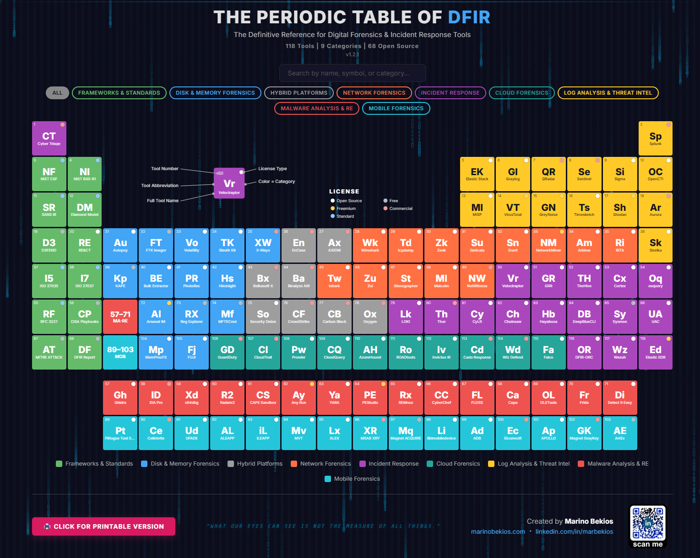
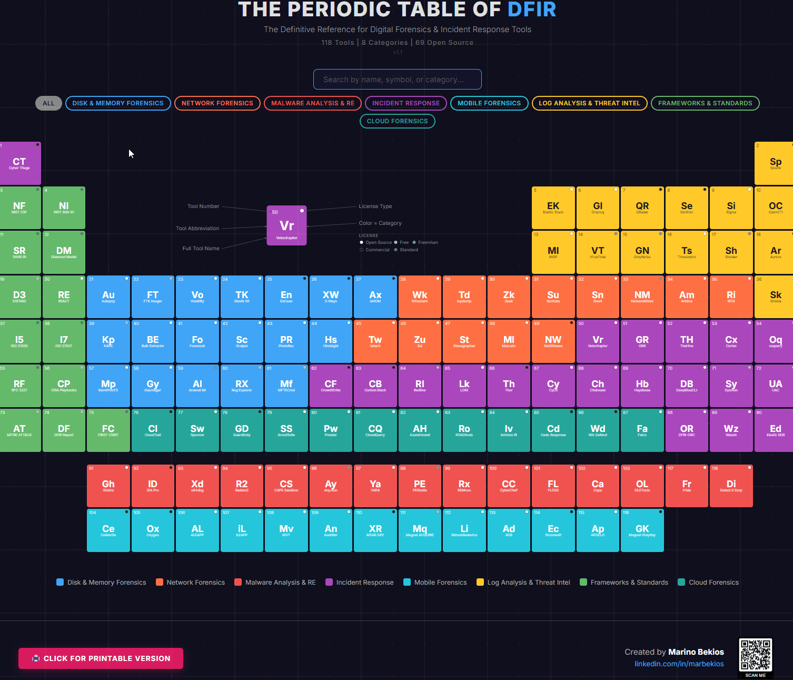

# THE PERIODIC TABLE OF DFIR

**The Definitive Reference for Digital Forensics & Incident Response Tools**

## What Is This?

An interactive, visual reference of 118 DFIR tools organized into 8 categories — inspired by the periodic table of elements. Built for analysts, incident responders, forensic investigators, and anyone who needs the right tool fast.

## Features

- **118 tools** across 8 categories
- Interactive hover cards with descriptions & direct links
- Click any tile to visit the tool's official website
- Search and category filtering
- Shareable filtered views via URL hash
- Print-ready high-resolution poster (A1 / 24x36")

## Tool Breakdown

| Type | Count |
|------|-------|
| Open Source | 69 |
| Commercial | 16 |
| Free | 11 |
| Freemium | 10 |
| Standards/Frameworks | 12 |
| **Total** | **118** |

## Categories

| Color | Category | Tools |
|-------|----------|-------|
| Green | Frameworks & Standards | 13 |
| Yellow | Log Analysis & Threat Intel | 14 |
| Blue | Disk & Memory Forensics | 18 |
| Orange | Network Forensics | 13 |
| Purple | Incident Response | 20 |
| Teal | Cloud Forensics | 12 |
| Red | Malware Analysis & RE | 15 |
| Cyan | Mobile Forensics | 13 |

## Live Demo

[View the interactive table](https://ledlight33.github.io/periodic-table-of-dfir/)

## Download Poster

Print it, frame it, hang it on your SOC wall:

- [PDF — A1 Print-Ready](assets/poster-a1.pdf)
- [PNG — 4K Resolution](assets/poster-4k.png)

## Contributing

Have a suggestion? Found an error? Want to propose a new tool?

**Two ways to contribute:**

1. **Open an Issue** — Describe what you'd like to change and why
2. **Submit a Pull Request** — Fork the repo, make your changes, and submit a PR with a clear description of what you changed and why

All contributions will be reviewed before merging. Please read [CONTRIBUTING.md](CONTRIBUTING.md) for guidelines.

## Changelog

See [CHANGELOG.md](CHANGELOG.md) for version history.

## License

- **Code:** MIT License  
- **Content & Design:** [CC BY-NC 4.0](https://creativecommons.org/licenses/by-nc/4.0/) — free to share with attribution for non-commercial use only  
- For commercial licensing inquiries: [linkedin.com/in/marbekios](https://linkedin.com/in/marbekios)

## Created By

**Marino Bekios**
[linkedin.com/in/marbekios](https://linkedin.com/in/marbekios)

---

*If this helped you, give it a star — it helps others find it too.*
