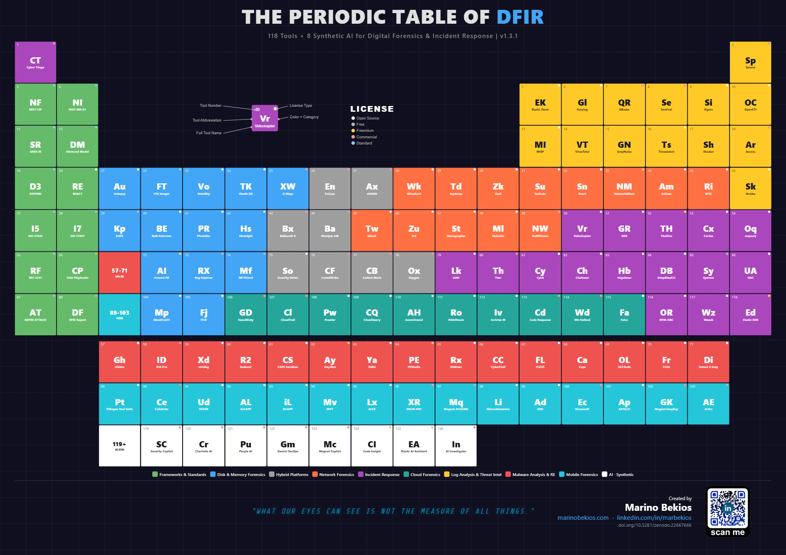

<h1 align="center">The Periodic Table of DFIR 🔎</h1>

<p align="center">
  <i>The definitive visual reference for Digital Forensics & Incident Response.</i>
  <br>
  <b>118 essential tools organized like the periodic table.</b>
</p>

---
<p align="center">
  
  
  
  
  
  
</p>



---

## What It Is

A single-page, fully interactive periodic table of the **118 most important tools** in Digital Forensics & Incident Response - from disk imaging to cloud forensics, from reverse engineering to mobile extraction.

Each tile is a real DFIR tool. Hover for a tooltip with the tool's purpose, license, supported platforms, and a link to its official page. Click any tile to open the tool's website.

The layout mirrors the structure of Mendeleev's periodic table - including **lanthanide and actinide-style indicator rows** for Malware Analysis (57-71) and Mobile Forensics (89-103).

And just like the real periodic table, elements beyond 118 are **synthetic** - lab-made, unstable, not yet confirmed. **Period 8 (elements 119+)** is a dedicated extension row for the emerging generation of **AI-powered DFIR tools**: Security Copilot, Charlotte AI, Purple AI, Gemini SecOps, Magnet Copilot, Code Insight, Elastic AI Assistant, and Cado AI Investigator. As they mature, synthetic elements can be "confirmed" and promoted into the main table.

---

## Live Demo

🔗 **[View the Periodic Table of DFIR](https://ledlight33.github.io/periodic-table-of-dfir/)**

🖨️ **[Printable Poster Edition](https://ledlight33.github.io/periodic-table-of-dfir/print.html)** - A1-ready, ideal for SOC walls and lab posters.

> 💡 **For the full interactive experience**, view on a **desktop browser at 1920×1080 or higher** - hover tooltips, the atmospheric wallpaper, and the full 18-column layout shine at full resolution. The page is responsive down to 768px (tablet/mobile), but tile names hide and the wallpaper effects scale down on smaller screens.

<video src="assets/demo13new.mp4" controls width="800"></video>

---

## Features

- 🧪 **118 tools** across 9 categories - every major DFIR domain covered
- ⚛️ **Period 8 - Synthetic Elements (119+)** - the AI DFIR generation as white, dashed, unstable tiles; click the **119+** tile to expand the row
- 📋 **One-click install commands** - 25 open-source tools carry a copyable `pip` / `brew` / `apt` / `winget` command right in the tooltip
- 🎨 **Color-coded tiles** by category, instantly readable
- ⚪ **License indicators** - Open Source, Free, Freemium, Commercial, Standard
- 🪟 🐧 🍎 **Platform support** in the hover tooltip - Windows, Linux, macOS, Web, Appliance
- 🔍 **Live search** by tool name, symbol, or category
- 🎯 **Category filters** with URL-shareable hash links
- ✨ **Lanthanide-style markers** - hover the row indicator to flash all related tools
- 🗂️ **Open dataset** - the full table as [`tools.json`](https://ledlight33.github.io/periodic-table-of-dfir/tools.json)
- 🖨️ **Print-ready poster version** for physical display

---

## Tool Breakdown

| License | Count |
|---|---|
| Open Source | 67 |
| Commercial | 24 |
| Freemium | 9 |
| Free | 11 |
| Standards / Frameworks | 7 |
| **Core table** | **118** |
| Synthetic AI (119-126) | 8 |
| **Grand total** | **126** |

---

## Categories

| Color | Category | Coverage |
|-------|----------|----------|
| 🔵 Blue | **Disk & Memory Forensics** | Imaging, file systems, memory analysis |
| 🟠 Orange | **Network Forensics** | PCAP analysis, IDS/IPS, full-packet capture |
| 🔴 Red | **Malware Analysis & RE** | Reverse engineering, sandboxes, static/dynamic analysis |
| 🟣 Purple | **Incident Response** | Triage, live response, EDR, threat hunting |
| 🌐 Cyan | **Mobile Forensics** | iOS, Android, mobile artifact parsers |
| 🟡 Yellow | **Log Analysis & Threat Intel** | SIEM, CTI platforms, log search |
| 🟢 Green | **Frameworks & Standards** | NIST, MITRE, ISO, SANS, RFCs |
| 🔵 Teal | **Cloud Forensics** | AWS, Azure, multi-cloud security tools |
| ⚪ Silver | **Hybrid Platforms** | All-in-one acquisition + analysis suites |
| ⚪ White | **AI · Synthetic (119+)** | AI copilots & assistants for DFIR - the unconfirmed elements |

---

## Tech Stack

Pure web - **no frameworks, no build step**.

- HTML5 + CSS Grid (18-column periodic layout)
- Vanilla JavaScript (zero dependencies)
- SVG for the legend / how-to-read element
- Google Fonts (Inter)

Loads instantly. Works offline. Self-contained.

---

## Local Development

Just clone and open:

```bash
git clone https://github.com/ledlight33/periodic-table-of-dfir.git
cd periodic-table-of-dfir
# Open index.html in any modern browser
```

No `npm install`, no build step, no server needed. Edit `script.js` to add or modify tools, refresh the page - done.

---

## File Structure

```
periodic-table-of-dfir/
├── index.html          # Interactive web version
├── print.html          # A1-ready printable poster edition
├── poster.html         # 4K PNG export source (3840×2160)
├── style.css           # All styling
├── script.js           # Tool data + rendering (single source of truth)
├── tools.json          # Open dataset - generated from script.js
├── scripts/            # build-tools-json.mjs generator
├── assets/             # QR code, preview images, demo.gif, posters
├── LICENSE             # MIT (code) + CC BY-NC 4.0 (content)
├── CHANGELOG.md        # Version history
├── CONTRIBUTING.md     # How to contribute
└── README.md
```

> 🗂️ **Open dataset:** the full table is published as machine-readable JSON at
> [`tools.json`](https://ledlight33.github.io/periodic-table-of-dfir/tools.json) - name, symbol, category, license, platforms, URL, description, and install command for all 126 elements. Free for non-commercial use with attribution (CC BY-NC 4.0). Regenerate after data changes with `node scripts/build-tools-json.mjs`.

---

## Versioning

**v1.3** is the current release.

### What's new in v1.3
- ⚛️ **Period 8 - Synthetic Elements (119-126):** an expandable extension row for AI DFIR tools (Security Copilot, Charlotte AI, Purple AI, Gemini SecOps, Magnet Copilot, Code Insight, Elastic AI Assistant, Cado AI Investigator) - click the 119+ tile under element 89 to reveal them, styled as unstable synthetic elements with their own AI · Synthetic category, filter, and legend entry
- 📋 **Install-command chips:** 25 open-source tools now show a copyable one-line install command (`pip` / `brew` / `apt` / `winget`) in their tooltip
- 🗂️ **tools.json open dataset** + generator script - the whole table as machine-readable JSON
- All 126 tool URLs verified working

### What's new in v1.2.3
- Dead links fixed: CISA Playbooks and Wiz Defend (pages had moved)
- EnCase URL updated - product renamed to OpenText Forensic
- TheHive reclassified Open Source → Freemium (TheHive 5 is commercial by StrangeBee; v4 AGPL is EOL) and URL updated
- Counts corrected: 67 Open Source, 9 Freemium

### What's new in v1.2.2
- FUJI description corrected - it is a macOS forensic acquisition tool, not iOS
- License breakdown corrected against the data: 68 Open Source, 24 Commercial, 8 Freemium, 11 Free, 7 Standards
- URL hash filters now replace previous filters instead of stacking
- Escape key clears the search box
- HTML validity fix in index.html

### What's new in v1.2.1
- FUJI moved to Disk & Memory Forensics (correct category), renumbered #105
- ScoutSuite removed; CloudTrail renumbered to #107
- ArtEx [AE] added to Mobile Forensics #103 - iOS artifact analysis tool (Windows)
- Elcomsoft (#100) platform corrected to cross-platform (Windows / Linux / macOS)
- Category filter buttons and legend reordered to match the table's visual flow
- Atmospheric quote added to poster.html footer

### What's new in v1.2
- 9th category added: **Hybrid Platforms**
- 6 tools removed (Foremost, Scalpel, Guymager, Sparrow, Andriller, Redline)
- 7 tools added (UFADE, ALEX, FUJI, Belkasoft X, Binalyze AIR, Security Onion, PiRogue Tool Suite)
- 5 tools moved to Hybrid Platforms (AXIOM, EnCase, CrowdStrike, Carbon Black, Oxygen)
- Renumbered row-by-row to mirror the real periodic table
- Lanthanide / actinide-style indicator markers for malware (57-71) and mobile (89-103)
- **Platform support icons in tooltips** (Windows / Linux / macOS / Web / Appliance)
- **Atmospheric wallpaper** - subtle matrix rain + scan beam behind the table on the live page
- Viewport-fit layout - no scrollbars on common desktop resolutions
- Improved license-dot colors for visibility on all backgrounds
- Larger tool names and license dots
- Search clear button (✕)
- Slower, smoother row-marker hover glow animation
- Dedicated **4K poster.html** for high-resolution PNG export
- HTML structure and metadata fixes

---

## Contributing

Found a missing tool? Spotted an outdated link? Have a suggestion?

- Open an [issue](https://github.com/ledlight33/periodic-table-of-dfir/issues) on GitHub
- Or reach out on [LinkedIn](https://linkedin.com/in/marbekios)

This project belongs to the DFIR community. Feedback shapes future versions.

---

## License & Usage

This project uses a **dual-license model**:

| Component | License |
|---|---|
| Code (HTML / CSS / JavaScript) | [MIT License](LICENSE) |
| Content, design & visual concept (table layout, categorization, color scheme, tile groupings, poster artwork, OG image, demo media) | [CC BY-NC 4.0](https://creativecommons.org/licenses/by-nc/4.0/) |

**You are free to:**
- Use the project for personal, educational, or non-commercial purposes
- Share and adapt the work, **with proper attribution to author**

### ⚠️ Commercial Use & Collaboration

The following uses **require prior written permission** from the author:

- Commercial use of any kind (resale, paid products, monetized content, premium services, advertising-supported sites)
- Integration into commercial products, platforms, or paid services
- Use in marketing, promotional, or revenue-generating materials
- Licensing for organizational, enterprise, or institutional deployment
- Custom commissions, partnerships, or sponsored/branded versions

To inquire about commercial licensing or any form of collaboration, please contact the author directly (see below).

All rights not expressly granted are reserved by the author.

---

## Author & Contact

Created by **Marino Bekios** - Cybersecurity Professional

- 🌐 **Website:** [marinobekios.com](https://marinobekios.com/)
- 💼 **LinkedIn:** [linkedin.com/in/marbekios](https://linkedin.com/in/marbekios)

For commercial licensing, partnerships, custom work, or any collaboration - please reach out via the website or LinkedIn.

---

## Credits & Acknowledgements

Inspired by Dmitri Mendeleev's original periodic table (1869) and the countless DFIR practitioners who build, maintain, and document the tools listed here. Every tile represents real work by real teams that the community depends on.

Special thanks to the open-source contributors behind the 67 free and open tools in this collection.

---

*If this helped you, give it a ⭐ - it helps others find it too.*
